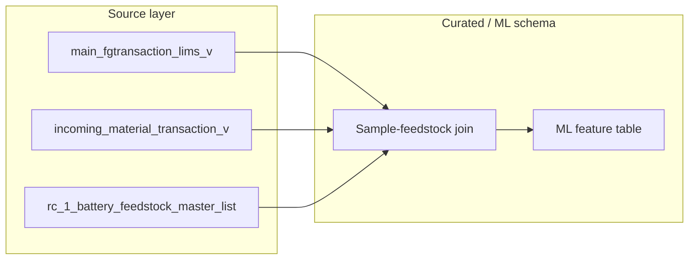

# Data Architecture and Feature Engineering Plan for CMC Ni/Co Prediction

## 1. Source tables (summary)

| Table                                        | Role                     | Key identifiers                                                           | Key timestamps                                                              | Key attributes                                                              |
| -------------------------------------------- | ------------------------ | ------------------------------------------------------------------------- | --------------------------------------------------------------------------- | --------------------------------------------------------------------------- |
| **cleansed.incoming_material_transaction_v** | Feedstock consumed       | `item_number`, `lot_number`                                               | `transaction_time_utc`, `transaction_time`                                  | `quantity` (mass), `plant_code`                                             |
| **cleansed.main_fgtransaction_lims_v**       | CMC output + lab results | `effective_sample_id`, `sample_id`, `lot_number`, `item_number` (product) | `start_time_local`, `transaction_time_local`, `sample_collected_time_local` | `nickel_ppm`, `cobalt_ppm`, `net_weight`, `description`, `sample_type`      |
| **rc_1_battery_feedstock_master_list_***     | Feedstock composition    | `item_code`                                                               | —                                                                           | `wt_ni_percent`, `wt_co_percent`, `unit_mass_kg`, `cathode_chemistry`, etc. |

Join chain: **LIMS (one row per sample)** → time window → **incoming_material_transaction** → **master list** (item_number = item_code) for composition.

---

## 2. Data architecture

### 2.1 Layers

- **Existing:** Keep `cleansed.*` and Fivetran SharePoint tables as-is (no schema changes).
- **New (recommended in same lakehouse):** Add a **curated / ML schema** (e.g. `curated.` or `ml.`) with two tables:
  - **Curated sample–feedstock join (optional):** Clean, time-aligned join of LIMS samples to incoming transactions and master list, still at transaction grain if useful for debugging.
  - **ML feature table (primary):** One row per CMC sample with targets and engineered features; consumed by training and inference.

No separate “new data lake” is recommended; same lakehouse, new schema and tables, with clear lineage: cleansed + Fivetran → curated → ML table.

### 2.2 Time alignment and timezone

- **Reference time for a CMC sample:** Use **start_time_local** (or, if you standardize on “lot fill” time, the field that best represents when the CMC lot was formed). Normalize everything to one timezone (e.g. plant local or UTC) in the pipeline.
- **Feedstock window:** For each sample, take incoming material transactions where:
  - `transaction_time` (or UTC equivalent converted to local) is in **[sample_start_time − 3 hr − buffer, sample_start_time]**.
  - Buffer: e.g. 0–1 hour to capture variance in residence time; tune with process knowledge.
- **Join key:** `incoming_material_transaction_v.item_number` = `rc_1_battery_feedstock_master_list.item_code` to get `wt_ni_percent`, `wt_co_percent`, etc.

### 2.3 Grain of the ML table

- **One row per CMC sample.** In LIMS, multiple FG rows can share the same `effective_sample_id` (composite sample) with the same lab results. Deduplicate so each `effective_sample_id` (or `sample_id` if you prefer) appears once.
- **Targets:** `nickel_ppm`, `cobalt_ppm` from LIMS (from any one of the rows that share that sample).
- **Filtering which rows are “CMC”:** Restrict to rows where `description` (or product `item_number`) corresponds to CMC output, e.g. “Calcined Concentrate”, “High Nickel RC1 Calcined Metal Concentrate”, and optionally “Processed Metal Concentrate (PMC)” if that is CMC. Exclude non-CMC (e.g. Exhaust Dust). Document the filter in the pipeline so it’s reproducible.

---

## 3. Data flow (high level)

- **Step 1:** From LIMS, take completed CMC samples (plant_code = '003', sample_status = 'SAMP_COMPLETED', description in CMC list), one row per `effective_sample_id`, with `start_time_local` (and timezone-normalized timestamp).
- **Step 2:** For each sample, select from `incoming_material_transaction_v` all rows with `transaction_time` in the 3 hr + buffer window and `plant_code = '003'`.
- **Step 3:** Join those transactions to the master list on `item_number = item_code`; compute mass-weighted and count-based aggregates (see Feature engineering).
- **Step 4:** Attach aggregates and other features to the sample row; write the ML table (one row per sample).

---

## 4. Feature engineering

### 4.1 Target definition

- **Targets:** `nickel_ppm`, `cobalt_ppm` from LIMS (same units as lab; no transformation unless you later standardize to percent or other units).
- **Rows:** Only samples with non-null Ni and Co and with at least one incoming transaction in the window (or explicitly flag “no feedstock in window” and decide whether to train on them).

### 4.2 Feedstock composition features (core)

From transactions in the time window joined to master:

- **Mass-weighted average Ni/Co in feed:**
  - `feed_ni_pct_wt_avg = sum(quantity * wt_ni_percent) / sum(quantity)`
  - `feed_co_pct_wt_avg = sum(quantity * wt_co_percent) / sum(quantity)`
- **Total mass in window:** `feed_total_quantity = sum(quantity)`
- **Ratio:** `feed_ni_co_ratio = feed_ni_pct_wt_avg / nullsafe(feed_co_pct_wt_avg)` (or use ratio from master when Co is 0).
- **Count of distinct part types:** `feed_item_count = count(distinct item_number)`.
- **Per-item presence or mass share:** Optional one-hot or “mass fraction per item_code” for top N part numbers to capture mix effects.

Use **quantity** from incoming as mass (confirm unit with site: kg vs lb). If you have **unit_mass_kg** in master and quantity is in pieces, you could derive mass as `quantity * unit_mass_kg` and use that in the weighted averages; otherwise treat quantity as mass.

### 4.3 Handling missing composition

- Transactions with `item_number` not in the master list: exclude from weighted averages, or put in an “unknown” bucket.
- **Features to add:** `feed_mass_matched_pct = sum(quantity for matched item_number) / sum(quantity)`; `feed_mass_unmatched` or count of unmatched transactions. Model can use these to downweight or flag low-overlap windows.

### 4.4 Other useful features

- **From LIMS (sample-level):** `net_weight` (output mass), `sample_type` (composite vs single), `hours_to_matched_sample` (if useful for quality flags).
- **Temporal:** Hour of day, day of week, shift (day/night from hour or from a shift table if available).
- **From master (aggregated over window):** e.g. fraction of feed with `high_ni_cathode = 'Yes'`, or dominant `cathode_chemistry` (e.g. NMC), or average `unit_mass_kg` (if quantity is count).

### 4.5 Feature table schema (conceptual)

- **Keys:** `effective_sample_id`, `sample_id`, `start_time_local`, `lot_number` (and any needed for traceability).
- **Targets:** `nickel_ppm`, `cobalt_ppm`.
- **Feedstock aggregates:** `feed_ni_pct_wt_avg`, `feed_co_pct_wt_avg`, `feed_total_quantity`, `feed_ni_co_ratio`, `feed_item_count`, `feed_mass_matched_pct`, etc.
- **Context:** `net_weight`, `sample_type`, `shift`, `hour_of_day`, `day_of_week`, and any chemistry/mix flags.

---

## 5. Implementation notes (no code)

- **Refresh:** Build the ML table in a batch job (e.g. daily or after each LIMS sync); join logic is deterministic so reprocessing is safe.
- **Historic vs recent sampling:** Same pipeline for all periods; the ML table will have more rows per shift where sampling frequency increased. No need to change grain.
- **Validation:** Sanity-check time alignment (e.g. plot feed Ni/Co vs CMC Ni/Co by sample; check that 3 hr shift improves correlation vs no shift). Check for duplicate `effective_sample_id` and null targets before training.
- **Documentation:** Keep a short data dictionary and a list of CMC `description` (and `item_number`) values used for filtering, plus the exact window definition (3 hr + buffer) and timezone.

This gives you a single ML-ready table with one row per CMC sample, time-aligned feedstock features, and clear data architecture for model training and evaluation (including multi-output Ni/Co as in the earlier discussion).